# assigment2web
Student: Atshybai Nurbolsyn
Group:IT-2503
Course: Web technology(Frontend)

Part #1: task-Flexbox 0.
The goal of this assignment is to understand and apply advanced CSS layout techniques using Flexbox and CSS Grid. For this assignment I wanted to create website for "Lana Del Rey". first created <heder class>
and listed some lav-links and used unordered list. 

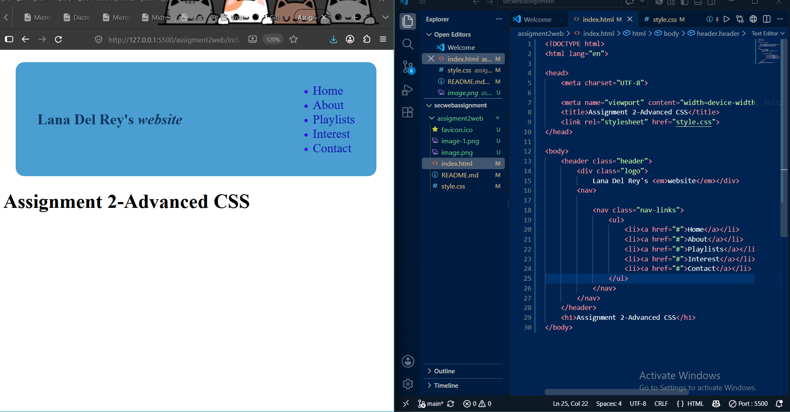

and there is css files:
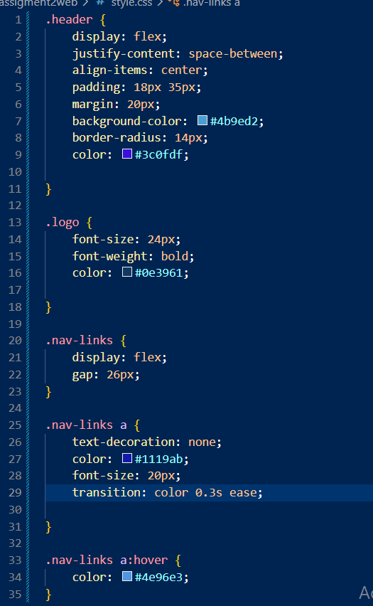

First task:
There I've created all my website files such as About me, My Playlists, Interest,contact and so on.
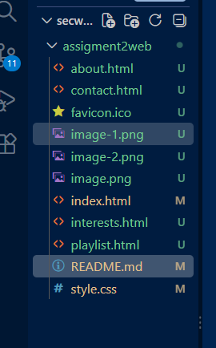
and there puted informations about Luna (task2)
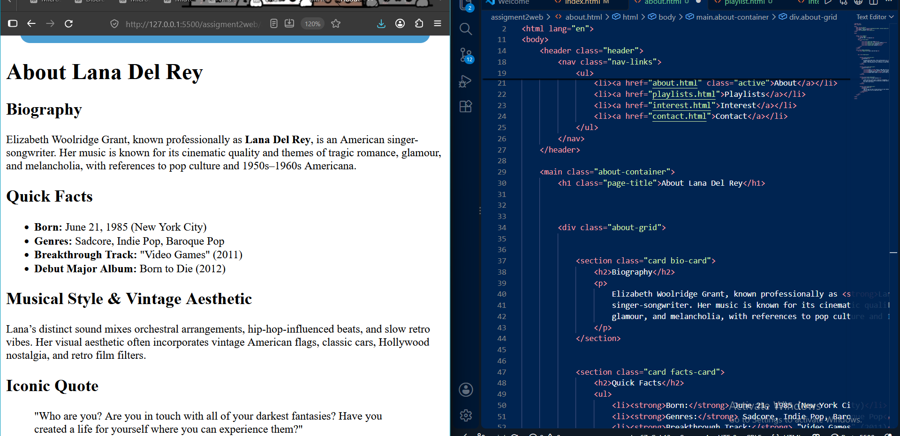 and it looks like 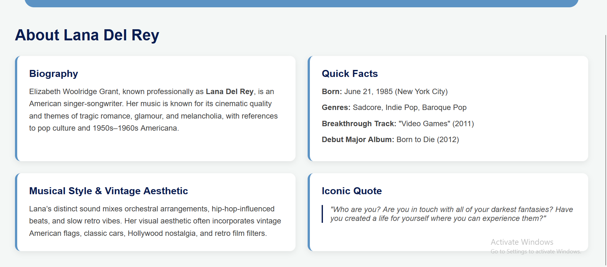
style is: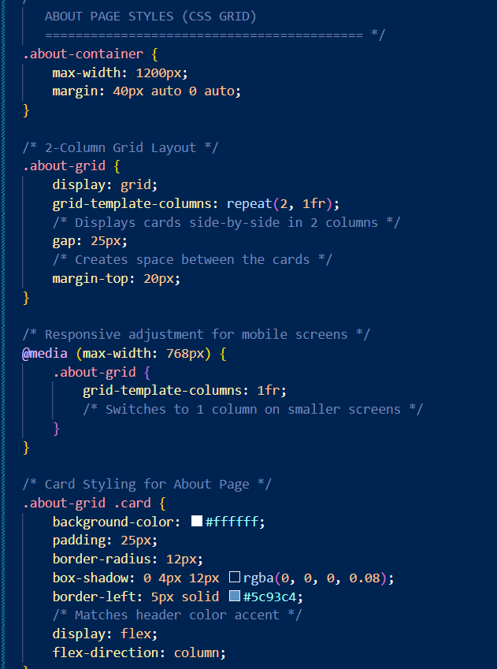 ,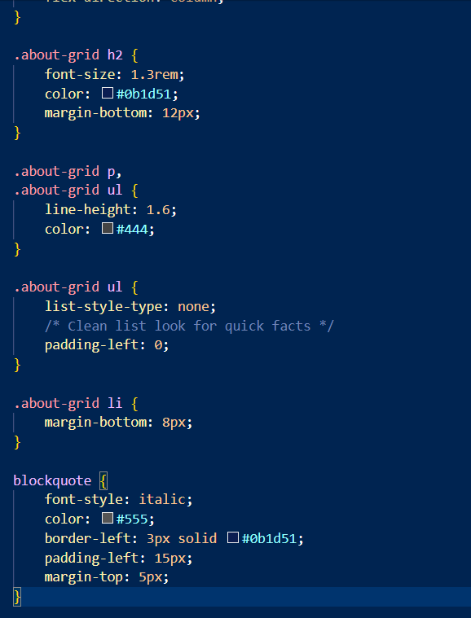

and next part created playlist page (task3)
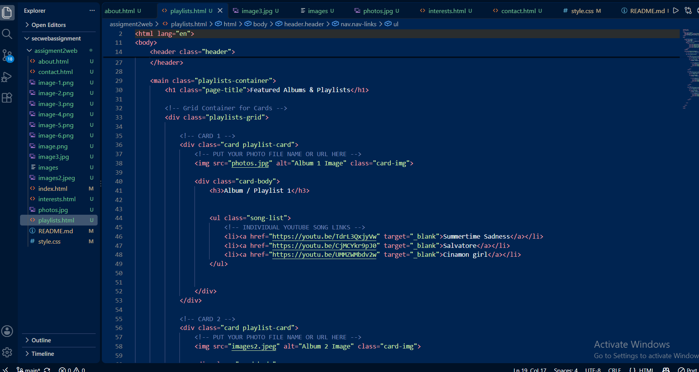 there you can see i puted fictures of Luna and puted youtube video links 
and style is 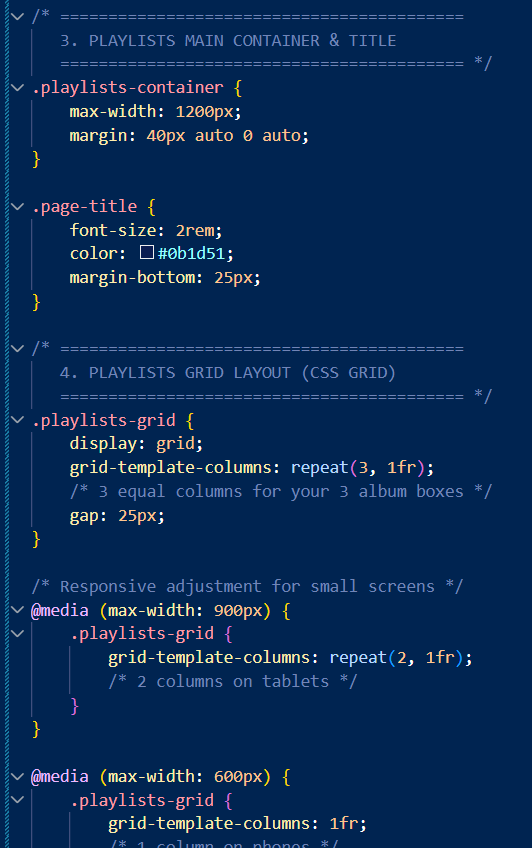 , 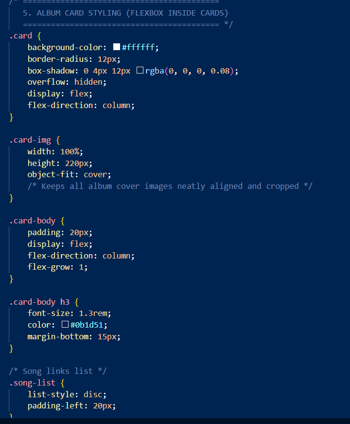,

(task4)
interests page 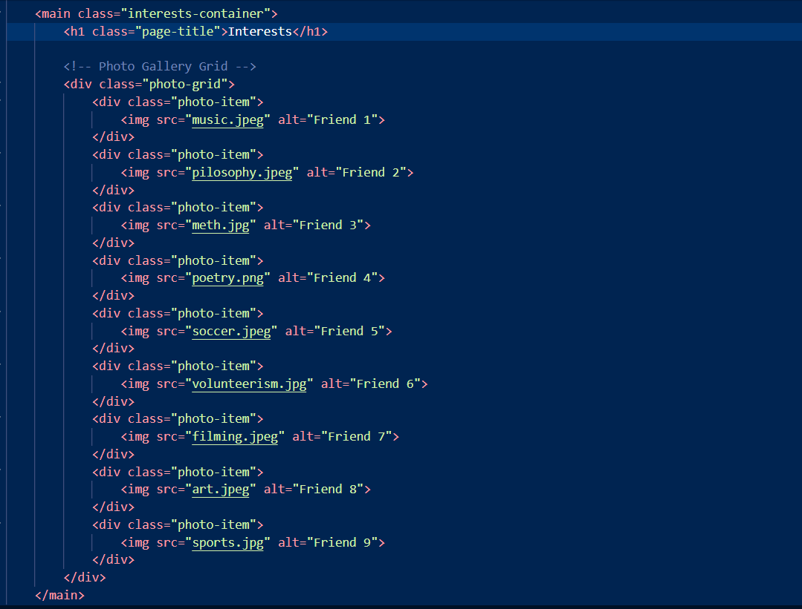 for this page i added 9 photos it looks like this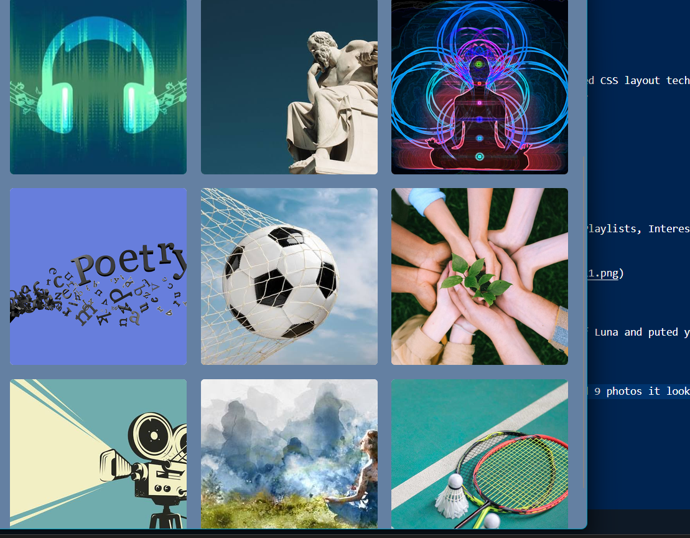 I used CSS Grid to arrange them in 3 rows and 3 columns. I also added gaps between the photos and a hover effect with the names.

